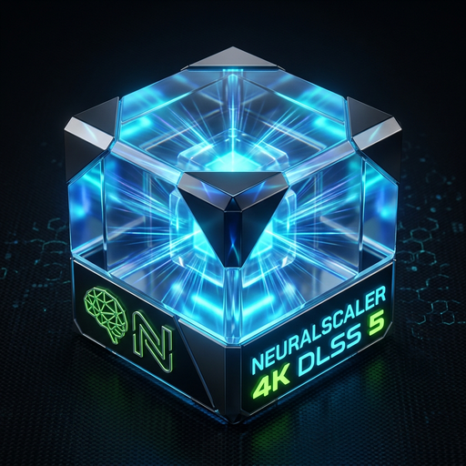

# NeuralScaler 4K (DLSS 5)

<p align="center">
  
</p>

<p align="center">
  <a href="README.md">English</a> | <b>简体中文</b>
</p>

---

NeuralScaler 4K 是基于 NVIDIA DLSS 5（深度学习超分辨率 5 代）神经重绘技术开发的离线高性能 4K 视频超分辨率工作站。项目集成了 DLSS 5 硬件加速管线、时空运动矢量光流推断、跨端原生色彩一致性引擎、动态显存保护机制以及硬件级双源锁步对比播放器，专为高画质、低延迟与色彩严谨的本地化视频重绘场景设计。

### 核心技术架构与特性

1. **基于 NVIDIA DLSS 5 的神经重绘与硬件超分**
   - 深度集成 NVIDIA DLSS 5 神经超分运行时（NVNGX 原生动态库 `nvngx_dlss.dll`、`nvngx_dlssd.dll`、`nvngx_dlssnr.dll`）。
   - 结合硬件级 Tensor Core 与光流加速器（Optical Flow Accelerator, OFA），利用多帧时域相关性与亚像素运动矢量，将低分辨率输入（540p / 720p / 1080p）精准重建至 4K 极清视频。
   - 相比传统双三次插值或常规深度学习放大，DLSS 5 能有效消除闪烁与伪影，显著提升细密纹理与运动边缘的保真度。

2. **跨端原生色彩一致性引擎（Cross-Platform ColorSync Pipeline）**
   - 彻底攻克了视频超分领域极少被公开攻破的行业痛点：**“超分后的 4K 在电脑上看色彩正常，但发到手机 OLED（Display P3 广色域）屏幕上却严重过饱和、肤色发红发浓、犹如被加了劣质滤镜”**；
   - 深度集成 ITU-R 国际色彩标准感知与自适应转换算法（`colormatrix=bt601:bt709`）：自动探测源流色彩空间，将标清/社交网络视频原生的 BT.601 YUV 色度矩阵严谨数学映射至 UHD 广播级 BT.709 空间，消除手机解码时因红绿通道比例失衡造成的偏色；
   - 严格对齐广播级受限动态范围（Limited Range 16-235）与标准 VUI 容器元数据，确保超分后无论在 PC 显示器、iPhone（iOS ColorSync）还是各大 Android 旗舰 OLED 屏上，均呈现 100% 自然素色与通透肤色，告别假滤镜感。

3. **流式分块处理与显存熔断保护**
   - 具备流式分块分片处理管道与实时显存熔断感知机制，在持续大吞吐超分任务中稳定运行，杜绝 CUDA 显存溢出（Out of Memory）异常。
   - 支持主流 NVIDIA GeForce RTX 系列独立显卡，自适应匹配物理计算单元与显存配置。

4. **硬件级锁步对比播放器 (Hover Wipe Player)**
   - 搭载连续自适应锁步同步引擎（Phase-Locked Loop），通过实时毫秒级相位误差反馈微调播放倍率，杜绝高码率 4K 重构流与原片之间的时序漂移。
   - 交互式无级卷帘对比与定格比对支持，实现 $dx=0, dy=0$ 的像素级物理对齐与实时细节反差校验。

---

### 系统要求

- **操作系统**: Windows 10 / Windows 11 64 位
- **显卡**: NVIDIA GeForce RTX 系列独立显卡 / AMD Radeon 显卡（显存至少 2GB）
- **驱动要求**: NVIDIA 驱动版本 >= 535.00
- **浏览器**: Microsoft Edge（系统内置）

---

### 快速上手

#### 方式 A：npm CLI 命令行极速超分（免图形界面）
```bash
# 无需手动安装，直接通过 npx 运行：
npx neuralscaler <input.mp4> --target 4K

# 或全局安装后直接使用简写命令 ns 极速超分：
npm install -g neuralscaler
ns input.mp4 -o D:\Output4K\ -t 4K -q FAITHFUL

# 也可在便携版/项目根目录直接调用：
ns.bat input.mp4 -t 4K
```

#### 方式 B：单文件安装向导（推荐桌面用户）
1. 从 [Releases](https://github.com/justForever17/NeuralScaler-4K/releases) 页面下载最新版单文件安装包（如 `NeuralScaler-4K-Setup-v*.exe`）。
2. 双击运行安装程序，按提示完成向导式安装。
3. 自动生成桌面高清图标快捷方式，并自动集成 Windows 资源管理器右键快捷菜单（支持在任意 `.mp4` / `.mov` / `.mkv` 视频上右键直接静默调用超分）。

#### 方式 C：便携绿色版运行（免安装）
1. 从 [Releases](https://github.com/justForever17/NeuralScaler-4K/releases) 页面下载便携版压缩包（如 `NeuralScaler-4K-Portable-windows-x64-v*.zip`）并解压。
2. 双击解压目录中的 `NeuralScaler.bat` 即可直接启动引擎并唤起独立工作站视窗（命令行中亦可直接使用 `ns.bat`）。

#### 方式 D：源码构建与本地运行
```powershell
# 1. 克隆代码仓库
git clone https://github.com/justForever17/NeuralScaler-4K.git
cd NeuralScaler-4K

# 2. 安装依赖并构建前端
npm install
npm run build

# 3. 运行服务与视窗
python server.py
```

---

## 赞助与支持

如果您觉得 NeuralScaler 4K 对您的创作或工作有所帮助，欢迎赞助支持本项目的持续维护与算力演进！

<p align="center">
  <a href="https://afdian.com/a/justforever17" target="_blank">
    
  </a>
</p>

---

### 开源协议

本项目采用 [MIT License](LICENSE) 开源协议。
